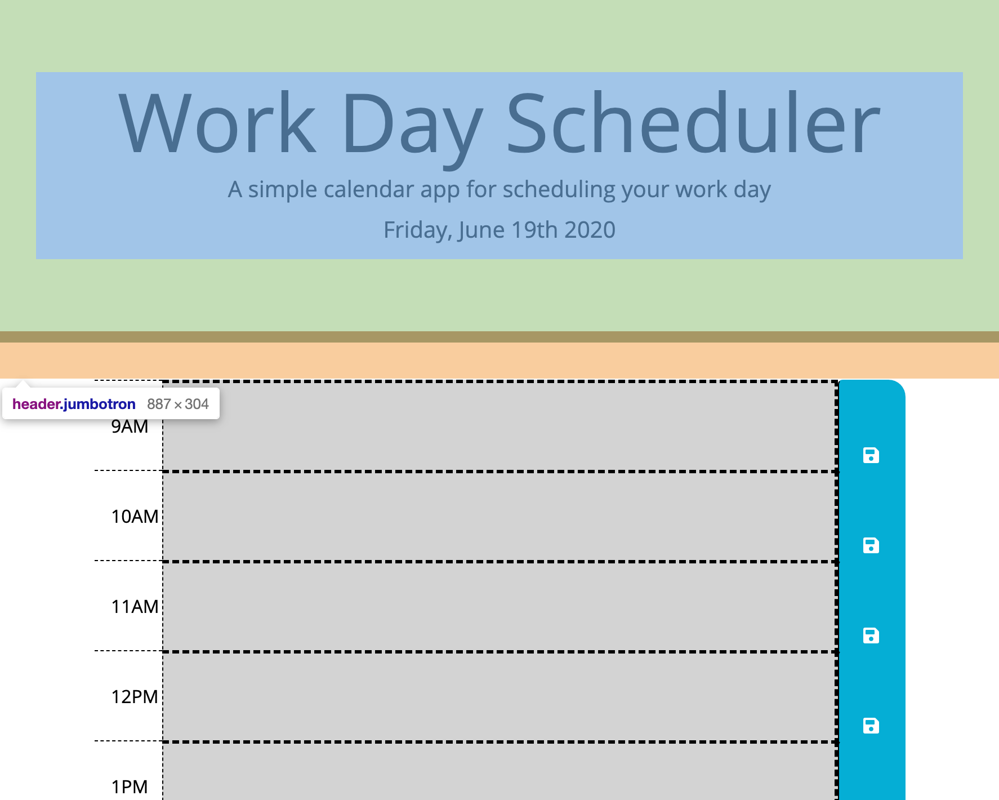
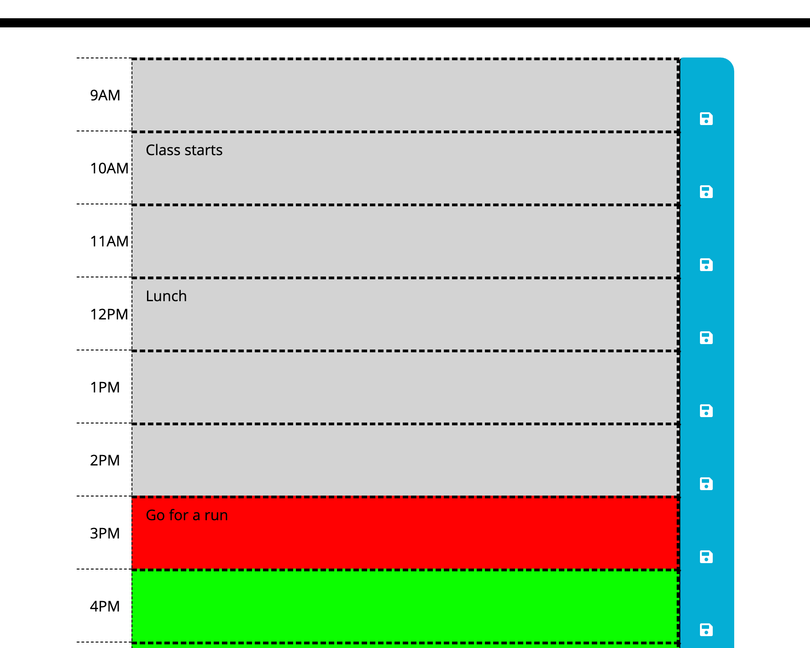

# day-planner

This application is a scheduler for a typical work day.

    -The current date is displayed on the webpage 
    -The user may enter a task within a timeslot.
    -When the user is ready to save their task, they may save it by clicking on the button to the right of the timeslot. 
    -The input will be persistent even after refreshing the page.
    -Timeslots associated with times in the past will be color coded grey.
    -The present timeslot will be color coded red.
    -Timeslots associated with times in the future will be color coded green.

See URL for demo: https://meierj423.github.io/day-planner/

